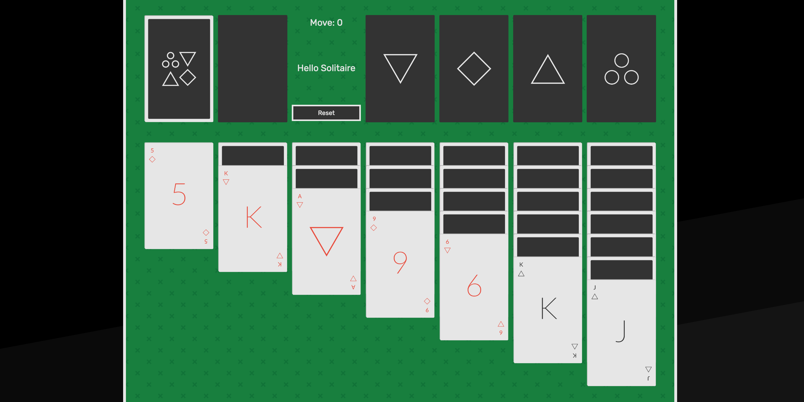

# Solitaire

Game Link: <a href="https://ashco.github.io/solitaire/">

This project was the result of General Assembly's Web Development Immersive Unit 1 project to build a game using what we had learned in the course so far. It served as a great way to understand how Javascript can be used to create a product through small and specific funcitons. I ran into many challenges and subsequent eureka moments during this game's week long development. 

### Biggest Issues

My biggest challange slapped me on the face on Day 5 when I realized the ability to move multiple cards at once (my final requirement before hitting MVP) would require very different logic to accomplish. After climbing out of GA's communal pit of dispair I ended up re-whiteboarding everything and making my code much cleaner and workable. A valuable lesson was learned and I will never ever ever put off fully thinking through how to solve a difficult problem just because it seems hard.  

### Other Thoughts

I feel a lot more solid on how to whip out functions, loops and how to approach a correctly project the first time. Solitaire has a lot of very specific logic which means I did a lot of debugging, so I became very familiar with the debugger console during the last few days. Trello boards are handy, too.  
## How to Play

The goal is to place all cards of the same suit in their respective holding areas, from Ace on up to King. Once you have done this and cleared the board, you've won! 

Manipulate the board to uncover hidden cards and reveal new moves. You can move cards by alternating stacks of Red and Black cards in sequential order (Red 6 on top of Black 7 on top of Red 8). Only Kings can be placed in empty columns. 

Click through the deck to cycle through extra cards if you run out of moves on the board. 

Click once to select, click again to move. Simple but addicting.

## Lingering Issues 

There are a few things that I am still not satisifed about with this project. If I had more time I would want to fix/implement the the following: 

- If given the time I think I could rewrite a lot of the code logic and make the game cleaner / less prone to errors. Two main approaches I would try: 
  1) Remove the blank card images and replace them with styled divs. The add/rmv image logic got kind of messy and I think some of it was because adding one card to an empty row kept the image count the same, requiring an if statement that caused more bugs than I care to admit. 
  2) Track the number of flipped cards through another variable. I currently determine which cards are face up with a ".flipped" class on each image. This can be confusing and would likely simplify a lot of things if it was tracked in a variable. 
- Fix a bug where the Ace of Hearts is not correctly recognized after it is placed in the suits area. Each card has a 'data-cardnum' value. It's value should be 0, but does not work as intended and breaks. I plan on fixing this bug to make the game fully playable. 
- Add a legit reset button. I wanted to use a function to loop through and replace the images, but ran short on time and could not figure it out. 
- CSS Grid height is longer than I'd like but I couldn't figure out how to reduce it.
- Selecting the top right suits cards causes the board to skip down a little to make room for the selector image.  
- Figure out how to DRY up the CSS. 
- Better CSS styling. I would like to take every chance I get to improve my CSS skills because they make a huge difference in how any product is perceived. 
- Add an option to play a harder 3 card draw mode.
- Sound effects. Gotta appeal to the kids.

Enjoy! 